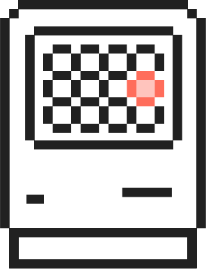

# Templates

Templates exist to formulate the layout and structure of a page. They utilise 
elements, patterns and tokens.

## Working with templates

Templates are nothing but Vue components that take up sections of the screen and 
consequently live in eponymous folders containing `Template.vue`, `Template.md` 
and `Template.styl` files.

Since Vocabulary is a design system and a component library, templates would 
ideally not be a part of it. However, the feature to supply templates is 
provided just in case.
